<div align="center">

# 🧠 QuizMaster

### *The Ultimate Interactive Quiz Experience*

[](https://developer.mozilla.org/en-US/docs/Web/HTML)
[](https://developer.mozilla.org/en-US/docs/Web/CSS)
[](https://developer.mozilla.org/en-US/docs/Web/JavaScript)
[](https://opentdb.com/)

[](https://github.com/salman284/QuizMaster)
[](https://github.com/salman284/QuizMaster/stargazers)
[](https://github.com/salman284/QuizMaster/network)

*A stunning, modern quiz application with dark ocean theme, smooth animations, and intelligent features*

[🎮 Try It Now](https://github.com/salman284/QuizMaster) • [📖 Documentation](#-getting-started) • [🛠️ Features](#-features) • [💻 Installation](#-installation)

</div>

---

## 🌟 Preview

<div align="center">

| 🏠 Home Screen | 🎯 Quiz Interface | 📊 Results |
|:---:|:---:|:---:|
|  |  |  |
| *Beautiful landing page with customizable settings* | *Smooth animations and instant feedback* | *Comprehensive performance analysis* |

</div>

## ✨ Features

<table>
<tr>
<td width="50%">

### 🎯 **Core Functionality**
- 🧪 **Multiple Choice Questions** - Interactive MCQ system
- ⏱️ **Smart Timer System** - Configurable 15-60 second timers
- 🎨 **Instant Visual Feedback** - Color-coded answer responses
- 📊 **Comprehensive Scoring** - Detailed performance analysis
- 🌐 **API Integration** - Thousands of questions via Open Trivia DB
- 📱 **Fully Responsive** - Perfect on all devices

</td>
<td width="50%">

### 🚀 **Advanced Features**
- ⚙️ **Customizable Settings** - Questions, difficulty, categories
- 📈 **Progress Tracking** - Visual progress bar and counters
- 🔄 **Review Mode** - Detailed answer review after completion
- 🛡️ **Fallback System** - Local questions when API unavailable
- 🎭 **Dark Ocean Theme** - Stunning purple-blue gradient design
- ⚡ **Smooth Animations** - CSS3 powered transitions

</td>
</tr>
</table>

## 🎮 How It Works

```mermaid
graph LR
    A[🏁 Start] --> B[⚙️ Customize Settings]
    B --> C[📡 Fetch Questions]
    C --> D[🎯 Answer Questions]
    D --> E[⏱️ Timer Management]
    E --> F[📊 View Results]
    F --> G[🔄 Review Answers]
    G --> H[🎉 Start New Quiz]
    H --> B
```

<div align="center">



</div>

## 💻 Installation

<details>
<summary><b>🚀 Quick Start (Click to expand)</b></summary>

### Option 1: Direct Download
```bash
# Clone the repository
git clone https://github.com/salman284/QuizMaster.git

# Navigate to the project
cd QuizMaster

# Open in browser
open index.html
```

### Option 2: GitHub Codespaces
[](https://github.com/codespaces/new?hide_repo_select=true&ref=main&repo=salman284/QuizMaster)

### Option 3: Local Development
1. 📁 Download or clone the repository
2. 🌐 Open `index.html` in any modern browser
3. 🎉 Start quizzing immediately!

</details>

## 🛠️ Technical Stack

<div align="center">

| Technology | Purpose | Version |
|:---:|:---:|:---:|
|  | Structure & Semantics | HTML5 |
|  | Styling & Animations | CSS3 |
|  | Logic & Interactivity | ES6+ |
|  | Question Database | REST API |

</div>

## 📁 Project Structure

```
QuizMaster/
├── 📄 index.html          # Main application entry point
├── 🎨 styles.css          # Complete styling & dark ocean theme
├── ⚡ script.js           # Quiz logic & API integration
├── 📖 README.md           # This awesome documentation
└── 📜 LICENSE             # MIT License
```

## 🎯 Configuration Options

<div align="center">

| Setting | Options | Default |
|:---:|:---:|:---:|
| **Questions** | 5, 10, 15, 20 | 10 |
| **Difficulty** | Easy, Medium, Hard, Any | Any |
| **Categories** | 8+ Categories | Any Category |
| **Timer** | 15s, 30s, 45s, 60s | 30s |

</div>

## 🌟 Key Features Breakdown

<details>
<summary><b>🎨 Dark Ocean Theme</b></summary>

- **Color Palette**: Deep purples, midnight blues, and dark teals
- **Gradients**: Smooth animated background transitions
- **Typography**: Modern Poppins font with perfect contrast
- **Cards**: Glass-morphism inspired white cards with shadows

</details>

<details>
<summary><b>🚀 Performance Optimized</b></summary>

- **Fast Loading**: Minimal dependencies, optimized assets
- **Smooth Animations**: Hardware-accelerated CSS transitions
- **Efficient API Usage**: Smart caching and error handling
- **Memory Management**: Proper cleanup of timers and listeners

</details>

<details>
<summary><b>📱 Responsive Design</b></summary>

- **Mobile First**: Optimized for smartphones and tablets
- **Flexible Grid**: CSS Grid and Flexbox for all layouts
- **Touch Friendly**: Large tap targets and smooth interactions
- **Cross Browser**: Compatible with all modern browsers

</details>

## 🔧 Browser Support

<div align="center">

| Browser | Minimum Version | Status |
|:---:|:---:|:---:|
|  | 60+ | ✅ Fully Supported |
|  | 55+ | ✅ Fully Supported |
|  | 12+ | ✅ Fully Supported |
|  | 79+ | ✅ Fully Supported |

</div>

## 🤝 Contributing

<div align="center">

We welcome contributions! Here's how you can help:

[](https://github.com/salman284/QuizMaster/fork)
[](https://github.com/salman284/QuizMaster/issues)
[](https://github.com/salman284/QuizMaster/issues/new)

</div>

1. 🍴 Fork the repository
2. 🌿 Create your feature branch (`git checkout -b feature/AmazingFeature`)
3. 💍 Commit your changes (`git commit -m 'Add some AmazingFeature'`)
4. 📤 Push to the branch (`git push origin feature/AmazingFeature`)
5. 🎉 Open a Pull Request

## 📊 Statistics

<div align="center">


</div>

## 🔮 Future Roadmap

- [ ] 👤 User Authentication & Profiles
- [ ] 🏆 Global Leaderboards
- [ ] 🎨 Multiple Theme Options
- [ ] 📊 Advanced Analytics Dashboard
- [ ] 🌐 Multiplayer Quiz Battles
- [ ] 📱 Progressive Web App (PWA)
- [ ] 🔊 Audio Questions Support
- [ ] 🏅 Achievement System

## 📄 License

<div align="center">

This project is licensed under the MIT License - see the [LICENSE](LICENSE) file for details.

[](https://opensource.org/licenses/MIT)

</div>

## 💖 Support

<div align="center">

If you found this project helpful, please consider:

[](https://github.com/salman284/QuizMaster)
[](https://github.com/salman284)

**Made with ❤️ by [Salman](https://github.com/salman284)**

---

<sub>🎯 Ready to test your knowledge? [Start your quiz journey now!](https://github.com/salman284/QuizMaster) 🚀</sub>

</div>